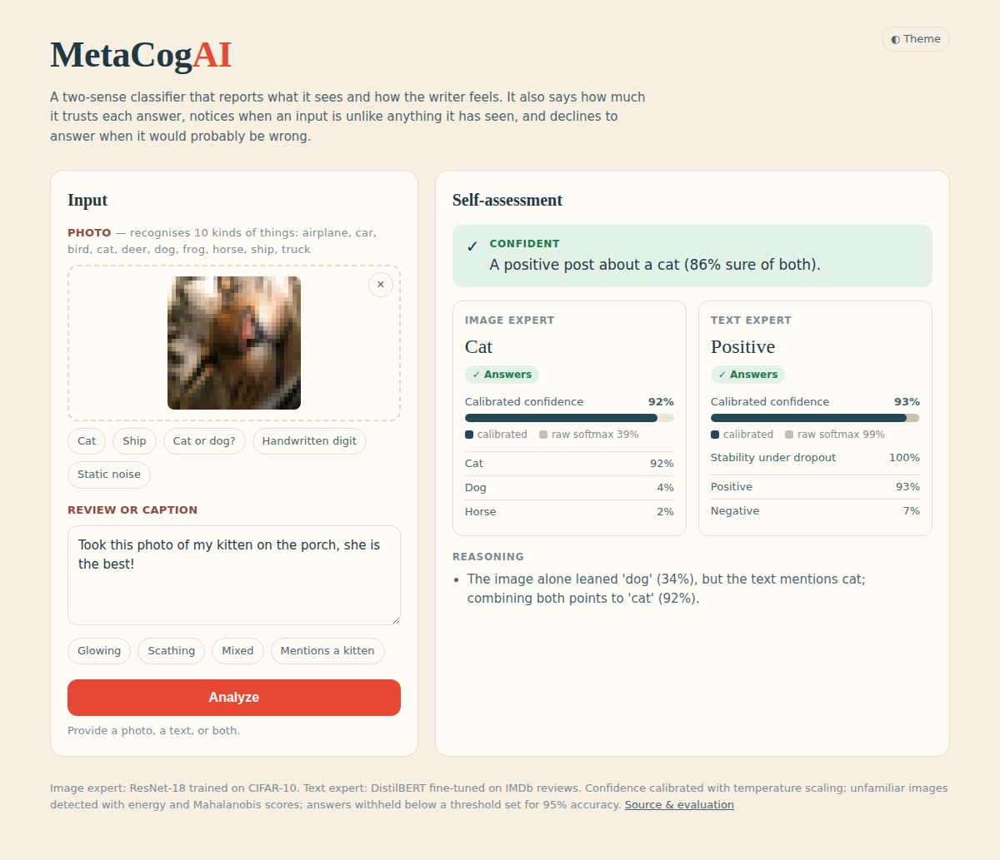
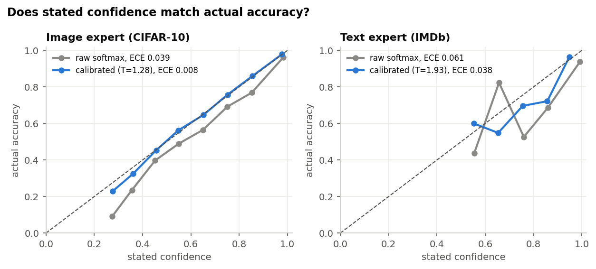
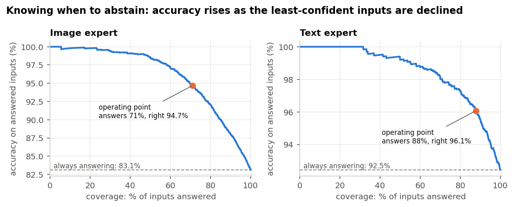
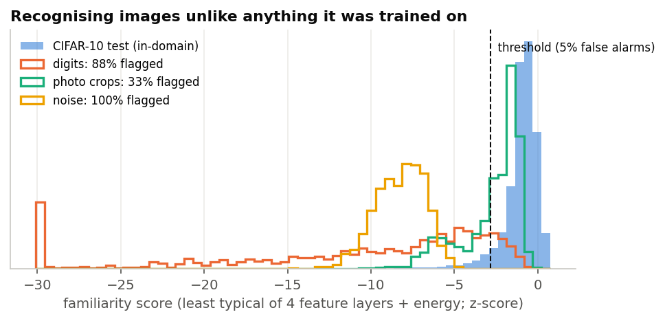

# MetaCogAI

**A multimodal classifier that knows when it doesn't know.**

[](https://github.com/sainikethkosaraju/MetaCogAI-Fusion/actions/workflows/tests.yml)


Give MetaCogAI a photo, a piece of text, or both (a picture with its caption or review). It tells you
what is in the picture and how the writer feels. More importantly, it also reports on its own
judgement:

* **How sure should I be?** Confidence scores are *calibrated*: when it says 80%, it is right about 80% of the time.
* **Is this the kind of input I was trained on?** It recognises images unlike anything in its training data instead of confidently mislabelling them.
* **Should I answer at all?** It declines when it would probably be wrong, and says why.
* **Do my two inputs agree?** Text that names what is in the picture ("my kitten…") is used as evidence about the image, and contradictions are flagged.

That ability to monitor and judge one's own knowledge is what psychologists call *metacognition*.

<p align="center"></p>

*Above: the image model alone leans "dog" (34%). The caption mentions a kitten, so MetaCogAI combines
both and answers "cat" (92%), which is correct, and explains its reasoning.*

## How it works

```
 photo ──► Image expert (ResNet-18, CIFAR-10) ──► logits + features ─┐
                                                                     ├─► Metacognition ─► self-assessment ─┐
 text ───► Text expert (DistilBERT, IMDb) ─────► logits + dropout ───┘   per input                         ├─► Fusion ─► report
                                                                                                           │
 text ───► class mentions ("puppy", "boat", …) ────────────────────────────────────────────────────────────┘
```

| Layer | What it does | Method |
|---|---|---|
| **Experts** | Image: which of 10 classes (airplane, car, bird, cat, deer, dog, frog, horse, ship, truck). Text: positive or negative sentiment. | ResNet-18 trained from scratch on CIFAR-10 (83% test accuracy); DistilBERT fine-tuned on IMDb (92%) |
| **Calibration** | Turns over-confident softmax scores into honest probabilities | Temperature scaling (Guo et al., 2017) |
| **Familiarity check** | Flags images unlike the training data | Mahalanobis distance at all four ResNet stages + energy score (Lee et al., 2018; Liu et al., 2020), each standardised, least-typical one wins |
| **Abstention** | Answers only when confident enough to be right ≥ 95% of the time | Selective prediction with a threshold fitted on held-out data (Geifman & El-Yaniv, 2017) |
| **Stability check** (text) | Flags mixed reviews whose prediction flips when parts of the network are switched off | Monte-Carlo dropout, 20 samples (Gal & Ghahramani, 2016) |
| **Fusion** | Uses class words in the text as evidence for the image, detects contradictions, reports *confident / partial / I don't know / inputs disagree* | Bayes update with an 80%-reliable caption model; joint confidence = product of calibrated confidences |

No threshold is set by hand. `scripts/calibrate.py` fits all of them on one half of each test set,
and every number below is measured on the *other* half.

## Results

Image: 5,000 held-out CIFAR-10 test images. Text: 2,000 held-out IMDb test reviews. Full numbers in [`results/metrics.json`](results/metrics.json).

### 1. Honest confidence

| | Accuracy | Mean stated confidence (raw → calibrated) | Calibration error, ECE (raw → calibrated) |
|---|---|---|---|
| Image expert | 83.1% | 87.1% → **83.0%** | 0.039 → **0.008** |
| Text expert | 92.5% | 98.2% → **92.5%** | 0.061 → **0.038** |

Both networks were over-confident, especially the text model, which claimed 98% on average while
being right 92% of the time. After calibration, stated confidence matches accuracy.

<p align="center"></p>

### 2. Knowing when to abstain

| | Always answering | MetaCogAI answers | Accuracy on answered | Accuracy on the ones it declined |
|---|---|---|---|---|
| Image expert | 83.1% correct | 71% of inputs | **94.7%** | 54.7% |
| Text expert | 92.5% correct | 88% of inputs | **96.1%** | 66.7% |

The inputs it declines really are the hard ones. It would have got almost half of the declined images wrong.

<p align="center"></p>

### 3. Recognising unfamiliar images

Three kinds of images that belong to none of the 10 classes, generated offline (1,000 each):
handwritten digits, crops of natural photographs (textures and scenes), and random noise.
The threshold flags 5.8% of real CIFAR-10 test images.

| Unfamiliar input | Plain network's mean confidence | Detection AUROC: softmax → MetaCogAI | Flagged as unfamiliar | Still answered confidently |
|---|---|---|---|---|
| Random noise | 87% | 0.64 → **1.00** | **100%** | **0%** |
| Handwritten digits | 68% | 0.79 → **0.97** | **88%** | 4% |
| Photo crops | 66% | 0.81 → **0.86** | 33% | 16% |

On random static the plain network is as confident (87%) as it is on real CIFAR-10 images. That is
exactly the failure metacognition is meant to catch. Early-layer feature statistics catch noise and
drawings, and the energy score catches unfamiliar content. Crops of real photographs are the hardest
case, because their low-level statistics look like real images.

<p align="center"></p>

### 4. Image + text together

**Text as evidence.** When a caption names an object, it is combined with the image by Bayes' rule.
On held-out images paired with simulated captions:

| Caption names the true object… | Image alone | Image + caption |
|---|---|---|
| 95% of the time | 83.1% | **97.3%** |
| 80% of the time | 83.1% | **93.8%** |
| 60% of the time | 83.1% | **88.6%** |

The captions here are simulated (a template naming either the true class or a random wrong one), so
these numbers show how the evidence combination behaves rather than real-world caption quality.

**Joint reports.** On 2,000 random (image, review) pairs, the system gave a full answer for 63%
(both parts right 90.7% of the time, against 77.7% if it always answered). It gave a partial answer
for 33% and said "I don't know" for 4%. The first version's rule picked whichever model had the
higher raw confidence and discarded the other answer. That meant the image prediction went
unreported 95% of the time.

### 5. Real photographs

A sanity check on 9 photos from the web (not CIFAR-10, not published here): it correctly identified
the horse, the fawn (as deer), the bird, the ship, the deer, the airliner and a cartoon airplane, all
with ≥ 85% confidence. It declined to label a close-up of a painted eye, which is not one of its
classes. It also declined a cat on a plain white studio background, an overly cautious miss caused
by the background looking nothing like CIFAR-10's.

## Try it

```bash
git clone https://github.com/sainikethkosaraju/MetaCogAI-Fusion.git
cd MetaCogAI-Fusion
python -m venv .venv && source .venv/bin/activate      # Windows: .venv\Scripts\activate
pip install torch torchvision --index-url https://download.pytorch.org/whl/cpu   # or a CUDA build
pip install -r requirements.txt

uvicorn app:app            # open http://127.0.0.1:8000
pytest -q                  # 13 tests, ~15 s
```

The trained weights ship with the repository: `weights/image_resnet18_cifar10.pth` (45 MB) and
`weights/text_model/` (DistilBERT in fp16, 134 MB, split into two files to fit GitHub's limits;
predictions are identical to the fp32 original).

Or from Python:

```python
from PIL import Image
from metacogai.system import MetaCogAI

ai = MetaCogAI()
report = ai.analyze(Image.open("photo.jpg"), "Took this photo of my kitten on the porch!")
print(report.status, "-", report.summary)
for line in report.reasoning:
    print(" •", line)
```

**API.** `POST /api/analyze` with multipart fields `image` (optional file) and `text` (optional string).
It returns the fused report, both self-assessments and the reasoning as JSON. Interactive docs are at `/docs`.

### Reproducing the evaluation

```bash
# CIFAR-10 python batches: https://www.cs.toronto.edu/~kriz/cifar.html
# IMDb test split as CSV:   python -c "from datasets import load_dataset; load_dataset('stanfordnlp/imdb')['test'].to_csv('data/imdb_test.csv')"
python scripts/cache_logits.py --cifar data/cifar-10-batches-py --imdb data/imdb_test.csv   # ~25 min on CPU
python scripts/calibrate.py   --cifar data/cifar-10-batches-py                              # fits all thresholds
python scripts/evaluate.py                                                                  # metrics + figures
```

To retrain the experts themselves: `python training/train_image_model.py` and `python training/train_text_model.py`.

## Project layout

```
app.py                     FastAPI server (UI + /api/analyze)
metacogai/
├── experts.py             image and text models, preprocessing
├── metacognition.py       calibration, familiarity check, abstention, MC dropout
├── fusion.py              cross-modal evidence, conflict detection, joint report
└── system.py              end-to-end pipeline
static/                    web interface and example images
weights/                   trained models + fitted calibration (metacog_calibration.json)
scripts/                   cache_logits.py → calibrate.py → evaluate.py
training/                  scripts that trained the two experts
results/                   metrics.json and figures
tests/                     unit, end-to-end and API tests
```

## Limitations

* The image expert knows only 10 categories, learned from 32×32-pixel images, so most real photos are low-resolution guesswork for it. The familiarity check helps, but a photo of something outside the 10 classes that *looks* like CIFAR-10 can still get through.
* The text expert was fine-tuned on 5,000 movie reviews. Sentiment in other domains (product reviews, tweets) is out of scope, and it has no out-of-domain check for text.
* Text-to-image evidence relies on a keyword list ("puppy" → dog, "boat" → ship), not language understanding.
* Out-of-domain evaluation uses synthetic and procedurally generated images, because standard benchmarks (SVHN, CIFAR-100) could not be downloaded in the build environment. `scripts/evaluate.py` is easy to extend with them.

## Changes from the first version

The first version (June 2025) had the right ideas, but the code on GitHub could not run:
* It imported files that were never uploaded (`utils/logger.py`, `models/fusion.py`).
* It was missing both trained models.
* The web page sent the image under a different field name than the server expected.
* Image preprocessing in the API (224 px, no normalisation) did not match training (32 px, normalised), which cut accuracy from 83% to 58%.
* "Confidence" was raw softmax with hand-picked thresholds.
* Fusion compared a sentiment score against an object score and kept only the larger one.

This version keeps the same two trained models and the same goal, and rebuilds everything around them.

## Author

**Sai Niketh Kosaraju**, Computer Science and Engineering, Shiv Nadar University

## References

Guo et al. (2017) *On calibration of modern neural networks* · Lee et al. (2018) *A simple unified framework for detecting out-of-distribution samples and adversarial attacks* · Liu et al. (2020) *Energy-based out-of-distribution detection* · Geifman & El-Yaniv (2017) *Selective classification for deep neural networks* · Gal & Ghahramani (2016) *Dropout as a Bayesian approximation* · He et al. (2016) ResNet · Sanh et al. (2019) DistilBERT · Krizhevsky (2009) CIFAR-10 · Maas et al. (2011) IMDb.
